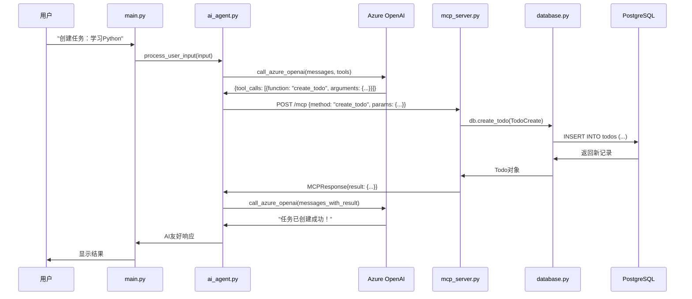

# 🐍 AI Agent MCP 待办事项应用 - Python调用关系详解

## 📋 核心调用链路

### 🎯 主要执行流程

```
用户输入 → main.py → ai_agent.py → Azure OpenAI → mcp_server.py → database.py → PostgreSQL
     ↑                                    ↓                           ↓
     └────────── 响应返回 ←─────────────────┴───────────────────────────┘
```

## 📁 各文件详细职责和调用关系

### 1. **main.py** - 用户交互入口 🎪
```python
# 职责：CLI用户界面，命令行交互
# 依赖：ai_agent.py, rich, typer

TodoApp类:
├─ __init__(): 创建AIAgent实例
├─ run_interactive(): 主交互循环
│  ├─ 显示欢迎界面
│  ├─ 获取用户输入
│  └─ 调用 → agent.process_user_input(user_input)
└─ 命令处理: interactive, server, setup
```

### 2. **ai_agent.py** - AI智能代理核心 🤖
```python
# 职责：协调AI决策和函数执行
# 依赖：httpx, Azure OpenAI API, MCP Server

AIAgent类:
├─ __init__(): 初始化Azure配置和工具定义
├─ process_user_input(): 主处理逻辑
│  ├─ 构建系统提示和用户消息
│  ├─ 调用 → call_azure_openai(messages, tools)
│  ├─ 解析GPT-4.1返回的tool_calls
│  └─ 调用 → execute_function_call(function_name, arguments)
├─ call_azure_openai(): 发送HTTP请求到Azure OpenAI
└─ execute_function_call(): 调用 → call_mcp_server(method, params)
```

**Function选择机制：**
- GPT-4.1模型根据用户输入和工具定义自动选择合适的function
- 工具定义包含详细的描述和参数模式
- 支持6种操作：create_todo, get_todos, update_todo, delete_todo, search_todos, mark_completed

### 3. **mcp_server.py** - MCP HTTP服务器 🌐
```python
# 职责：提供MCP协议的HTTP API接口
# 依赖：FastAPI, models.py, database.py

FastAPI应用:
├─ POST /mcp: handle_mcp_request()
│  ├─ 解析MCPRequest(method, params)
│  ├─ 根据method路由到对应操作:
│  │  ├─ "create_todo" → db.create_todo(TodoCreate(**params))
│  │  ├─ "get_todos" → db.get_todos(completed=params.get("completed"))
│  │  ├─ "update_todo" → db.update_todo(id, TodoUpdate(**update_data))
│  │  ├─ "delete_todo" → db.delete_todo(id)
│  │  ├─ "search_todos" → db.search_todos(query)
│  │  └─ "mark_completed" → db.update_todo(id, TodoUpdate(completed=True))
│  └─ 返回MCPResponse(result/error)
└─ GET /health: health_check() → 测试数据库连接
```

### 4. **database.py** - 数据访问层 🗄️
```python
# 职责：封装所有PostgreSQL数据库操作
# 依赖：psycopg2, models.py

DatabaseManager类:
├─ __init__(): 读取DATABASE_URL环境变量
├─ get_connection(): 创建psycopg2连接
├─ create_todo(TodoCreate) → Todo: INSERT新记录
├─ get_todos(completed?) → List[Todo]: SELECT查询
├─ get_todo_by_id(id) → Todo?: SELECT BY ID
├─ update_todo(id, TodoUpdate) → Todo?: UPDATE记录
├─ delete_todo(id) → bool: DELETE记录
└─ search_todos(query) → List[Todo]: ILIKE模糊查询
```

### 5. **models.py** - 数据模型定义 📋
```python
# 职责：定义数据结构和类型验证
# 依赖：pydantic

数据模型:
├─ TodoBase: 基础字段 (title, content, due_date)
├─ TodoCreate: 创建请求模型 (继承TodoBase)
├─ TodoUpdate: 更新请求模型 (所有字段可选)
├─ Todo: 完整模型 (包含id, completed, 时间戳)
├─ MCPRequest: MCP请求格式 (method, params)
└─ MCPResponse: MCP响应格式 (result, error)
```

### 6. **enhanced_ai_agent.py** - 增强版AI代理 🚀
```python
# 职责：提供基于规则的function选择机制
# 依赖：re, ai_agent.py的所有依赖

EnhancedAIAgent类:
├─ analyze_user_intent(): 基于正则表达式和关键词匹配
├─ extract_parameters(): 从用户输入提取函数参数
├─ process_user_input_with_intent_analysis(): 意图分析优先
└─ process_user_input_with_ai(): 回退到AI模型决策
```

## 🔄 典型调用序列图



## 🏗️ 架构特点分析

### ✅ 优势

1. **分层清晰**: 每层职责单一，耦合度低
2. **标准化**: 使用MCP协议，便于集成
3. **可扩展**: 易于添加新功能或替换组件
4. **AI智能**: GPT-4.1自动选择合适的函数
5. **类型安全**: Pydantic提供运行时类型检查
6. **容错性**: 每层都有异常处理机制

### 🎯 关键设计决策

1. **为什么使用MCP协议？**
   - 标准化的AI Agent通信协议
   - 便于与其他AI工具集成
   - 支持function calling模式

2. **为什么选择FastAPI？**
   - 自动生成OpenAPI文档
   - 原生支持异步处理
   - 内置数据验证

3. **为什么使用PostgreSQL？**
   - 支持复杂查询（ILIKE模糊搜索）
   - 事务安全
   - 生产环境稳定

4. **为什么分离AI Agent和MCP服务器？**
   - 解耦AI逻辑和数据操作
   - MCP服务器可独立扩展
   - 支持多个客户端接入

## 📊 依赖关系统计

### 外部库依赖 (按类型分组)
- **AI/HTTP**: httpx, openai
- **Web框架**: fastapi, uvicorn
- **数据库**: psycopg2-binary
- **数据验证**: pydantic
- **CLI界面**: rich, typer
- **环境配置**: python-dotenv
- **Python内置**: asyncio, json, os, sys, re

### 内部文件依赖
```
models.py (0依赖) ←── database.py ←── mcp_server.py
                              ↑
ai_agent.py ←── main.py, demo.py, test_function_selection.py
     ↑
enhanced_ai_agent.py
```

## 💡 扩展建议

1. **添加缓存层**: Redis缓存频繁查询
2. **消息队列**: 处理异步任务
3. **日志系统**: 结构化日志记录
4. **监控指标**: Prometheus + Grafana
5. **API网关**: 统一入口和限流
6. **多租户**: 支持多用户数据隔离

这个架构体现了现代微服务和AI应用的最佳实践，具有良好的可维护性和扩展性。
